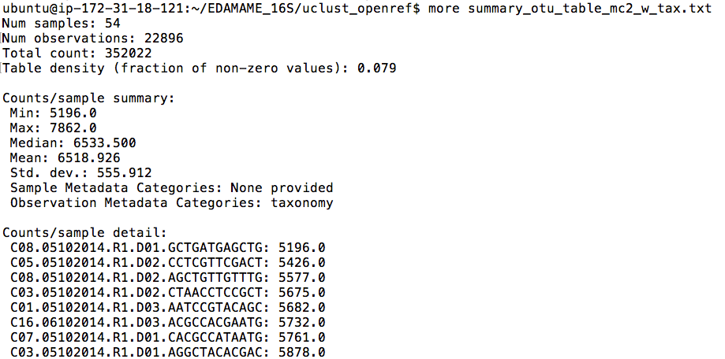
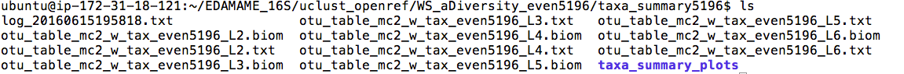
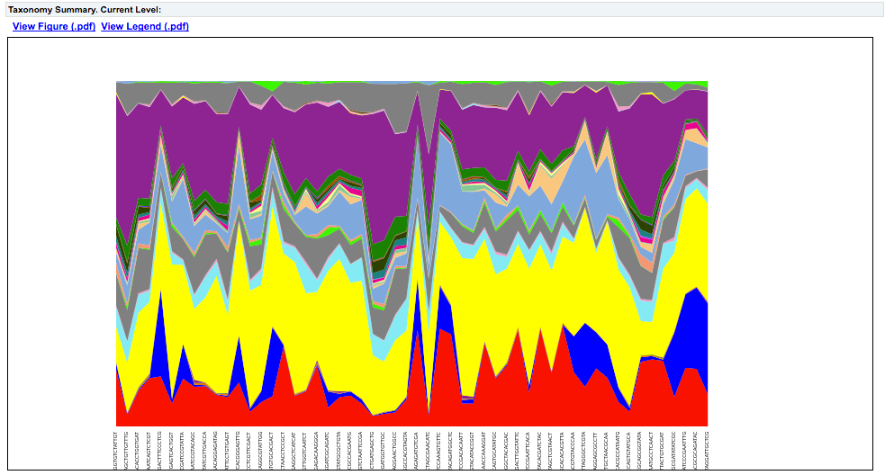
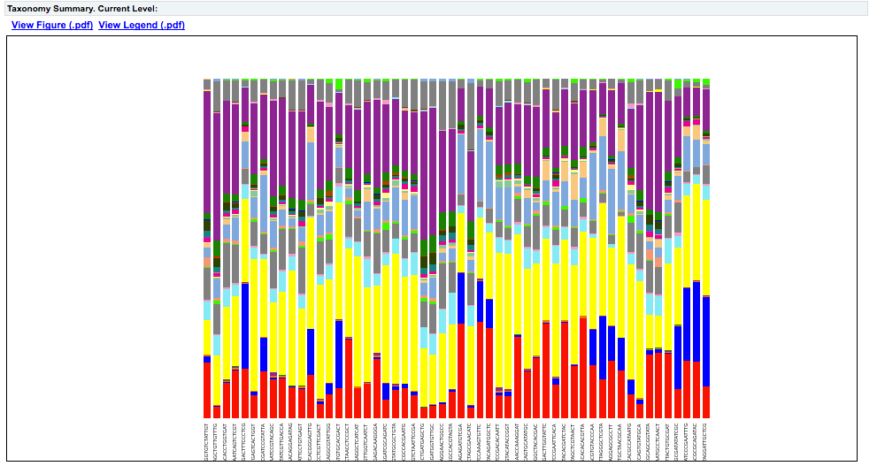

#QIIME Tutorial 2
Authored by Ashley Shade, with contributions by Sang-Hoon Lee, Siobhan Cusack, Jackson Sorensen, and John Chodkowski.  Modified by Adina Howe.
[EDAMAME-2016 wiki](https://github.com/edamame-course/2016-tutorials/wiki)

***
EDAMAME tutorials have a CC-BY [license](https://github.com/edamame-course/2015-tutorials/blob/master/LICENSE.md). _Share, adapt, and attribute please!_
***

##Overarching Goal  
* This tutorial will contribute towards an understanding of **microbial amplicon analysis**

##Learning Objectives
* Extract summary information from a biom OTU table
* Calculate and visualize within-sample (alpha) diversity

***


###Handout of workflow:
-  [Paired-End Illumina QIIME open-reference workflow](https://github.com/edamame-course/2015-tutorials/blob/master/QIIME_files/QIIME%20flow%20chart.pdf)

***

_Welcome back, Microbe Enthusiasts!_  

## Working with the OTU table in QIIME

Previously, we left off with quality-controlled merged Illumina paired-end sequences, and then used a QIIME workflow script to pick OTUs with one representative sequence from each OTU, align the representative sequences, build a tree build the alignment, and assign taxonomy to the OTU based on the representative sequence.  Wow.  That is a LOT.  Take a moment to relish in your own computational prowess.


If you wish to filter your table before proceeding with summary statistics and visual representations (for example to remove chloroplast or mitochondrial sequences), check out [these](http://qiime.org/scripts/filter_otus_from_otu_table.html) QIIME [tutorials](http://qiime.org/tutorials/filtering_contamination_otus.html) addressing this. 


### 2.1  Summarize an OTU table

Navigate to the uclust_openref/ directory. The OTU table is the table on which all ecological analyses (e.g. diversity, patterns, etc) are performed.  Let's use biom commands to summarize the table.  Let's proceed with the table that has singletons removed and taxonomy assigned ("mc2_w_tax.biom").

```
biom summarize-table -i otu_table_mc2_w_tax.biom -o summary_otu_table_mc2_w_tax.txt

less summary_otu_table_mc2_w_tax.txt
```

The summary file contains information about the number of sequences per sample, which will help us to make decisions about rarefaction (subsampling).  When we inspect the file, we see that sample C08.05102014.R1.D01.GCTGATGAGCTG has the minimum number of reads observed.  This is what we will use as a subsampling depth.  Also, a lot of the info in this file is typically reported in methods sections of manuscripts.




### 2.3 Calculating within-sample (alpha) diversity

Make sure you are in the the uclust_openref/ directory, and make a new directory for alpha diversity results.

```
mkdir WS_aDiversity_even5196

```

We will calculate richness (observed # taxa) and phylogenetic diversity (PD) for each sample.  Documentation is [here](http://qiime.org/scripts/alpha_diversity.html).

```
alpha_diversity.py -i otu_table_mc2.biom -m observed_species,PD_whole_tree -o WS_aDivers
ity_even5196/WS_aDiversity_even5196.txt -t rep_set.tre
```

The `-t` flag designates the tree file for calculating phylogenetic diversity. As always, inspect the results file.  What are the ranges that were observed in richness and PD?

```
head WS_aDiversity_even5196/WS_aDiversity_even5196.txt
```

QIIME offers a variety of additional options for calculating diversity, and the -s option prints them all!

```
alpha_diversity.py -s
```

There is workflow script, [alpha_rarefaction.py](http://qiime.org/scripts/alpha_rarefaction.html), which is useful if you want to understand how measures of alpha diversity change with sequencing effort.  The script calculates alpha diversity on iterations of a subsampled OTU table.

### 2.4 Visualizing within-sample diversity

`summarize_taxa_through_plots.py` is a QIIME workflow script that calculates summaries of OTUs at different taxonomic levels. Documentation is [here](http://qiime.org/scripts/summarize_taxa_through_plots.html). This will take about 10 minutes; if you want to be safe, you can [tmux](https://github.com/edamame-course/2015-tutorials/blob/master/final/2015-06-22_tmux.md).

```
summarize_taxa_through_plots.py -o WS_aDiversity_even5196/taxa_summary5196/ -i otu_table_mc2_w_tax_even5196.biom  
```

When the script is finished, navigate into the results file, and into the "taxa_summary_plots" and find the html area and bar charts.
As you are navigating to these html files, notice that the script has produced an OTU/biom table for every taxonomic level (designated by the "L"):



The "L" stands for "lineage", and each "level" is designated by a number.  L1 is Domain, L2 is Phylum, L3 is Class, etc.  The more resolved the lineage (higher number), the less accurate the definition (e.g., L6 is not entirely and consistently the same as  "genus").

To view the HTML files, you will need to transfer the HTML files themselves and their companion files in the ```charts``` directory to your desktop using scp. Open a terminal with the working directory on your computer, not the EC2.

**Note**: In the command below, make sure you place the -r flag before the -i flag. 

```
scp -r -i **your/key/file** ubuntu@**your_DNS**:EDAMAME_16S/uclust_openref/WS_aDiversity_even5196/taxa_summary5196/taxa_summary_plots ~/Desktop

```
The last command above contains the ```-r``` flag after ```scp```. The r means "recursive", and specifies that because we have a whole directory full of files, we want scp to go back and grab all of the files there, not just one. You will get an error if you try to scp a directory without the -r flag.  

Now go to the desktop and double-click on area_charts.html:


 and bar_charts.html:



The links above and below the charts point to the raw data or other summaries.  Spend some time exploring all of the different links.

In your browser, carefully inspect and interact with these quick charts.  Though these are not publication-ready, they are a great first exploration of the taxa in the dataset.


***

## Where to find QIIME resources and help
*  [QIIME](qiime.org) offers a suite of developer-designed [tutorials](http://www.qiime.org/tutorials/tutorial.html).
*  [Documentation](http://www.qiime.org/scripts/index.html) for all QIIME scripts.
*  There is a very active [QIIME Forum](https://groups.google.com/forum/#!forum/qiime-forum) on Google Groups.  This is a great place to troubleshoot problems, responses often are returned in a few hours!
*  The [QIIME Blog](http://qiime.wordpress.com/) provides updates like bug fixes, new features, and new releases.
*  QIIME development is on [GitHub](https://github.com/biocore/qiime).


-----------------------------------------------
-----------------------------------------------
